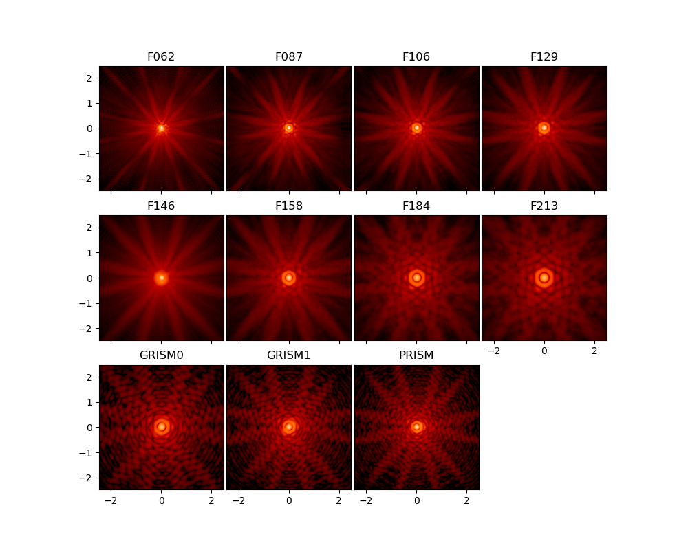

Documentation for STPSF
===============================

**(Formerly WebbPSF, for versions < 2.0)**

STPSF is a Python package that computes simulated point spread functions (PSFs) for NASA's James Webb Space Telescope (JWST) and Nancy Grace Roman Space Telescope. STPSF transforms models of telescope and instrument optical state into PSFs, taking into account detector pixel scales, rotations, filter profiles, and point source spectra. It is rather a tool for transforming optical path difference (OPD) maps, created with observatory systems engineering models, into the resulting PSFs as observed with JWST's or Roman's instruments.

.. figure:: ./fig_instrument_comparison.png
   :scale: 45 %
   :align: center
   :alt: Sample PSFs for JWST's instruments.

   Sample PSFs for JWST's instrument suite, all on the same angular scale and display stretch.

   Sample PSFs for the filters in the Roman WFI on SCA01. Note that
   the prism and grism PSFs shown here are monochromatic.

**Contributors:**
STPSF has been developed by Marshall Perrin, Marcio Meléndez, Shannon Osborne, Robel Geda, Brad Sappington, Charles-Philippe Lajoie, Joseph Long, Justin Otor, Jarron Leisenring, Neil Zimmerman, Keira Brooks, and Anand Sivaramakrishnan, with contributions from Alden Jurling, Lauren Chambers, Ewan Douglas, and `others <https://github.com/spacetelescope/stpsf/graphs/contributors>`_.

Getting Started with STPSF
----------------------------

See `Using STPSF <usage.html>`_.

.. admonition:: Quickstart Jupyter Notebook

   This documentation is complemented by an `Jupyter Notebook format quickstart tutorial <http://nbviewer.jupyter.org/github/spacetelescope/stpsf/blob/stable/notebooks/STPSF_tutorial.ipynb>`_. Downloading and running that notebook is a great way to get started using STPSF.

.. admonition:: Getting Help

   For help using or installing stpsf, you can contact the STScI JWST Help Desk at jwsthelp.stsci.edu, category STPSF/JWST Telescope.

:ref:`What's new in the latest release? <whatsnew>`

Contents
--------

.. toctree::
   :maxdepth: 1
   :caption: Getting Started

   intro.rst
   installation.rst
   relnotes.rst
   usage.ipynb
   psf_grids.ipynb

.. toctree::
   :maxdepth: 1
   :caption: Modeling JWST PSFs

   jwst.rst
   more_examples.rst
   jwst_measured_opds.ipynb
   jwst_detector_effects.ipynb
   jwst_matching_psfs_to_data.ipynb
   jwst_ifu_datacubes.ipynb
   jwst_large_psf.ipynb
   jwst_optical_budgets.ipynb
   jwst_psf_subtraction.ipynb
   jwst_wavefront_deltas.ipynb
   less_common_usage.rst

.. toctree::
   :maxdepth: 1
   :caption: Modeling Roman PSFs

   roman.rst

.. toctree::
   :maxdepth: 1
   :caption: Package Documentation

   api_reference.rst
   help.rst
   sampling.rst
   fft_optimization.rst
   poppy.rst

.. toctree::
   :maxdepth: 1
   :caption: Developer Reference

   available_opds.rst
   field_dependence/multifield_documentation.ipynb
   references.rst
   release.rst

.. admonition:: How to cite STPSF

    In addition to this documentation, STPSF is described in the following references.  Users of STPSF are encouraged to cite one of these.

    * Perrin et al. 2014, `"Updated point spread function simulations for JWST with STPSF" <http://adsabs.harvard.edu/abs/2014SPIE.9143E..3XP>`_,  Proc. SPIE. 9143,
    * Perrin et al. 2012, `"Simulating point spread functions for the James Webb Space Telescope with STPSF", <http://adsabs.harvard.edu/abs/2012SPIE.8442E..3DP>`_ Proc SPIE 8842, and
    * Perrin 2011, `Improved PSF Simulations for JWST: Methods, Algorithms, and Validation <Improved_PSFs_for_Webb.pdf>`_, JWST Technical report JWST-STScI-002469.

    In particular, the 2012 SPIE paper gives a broad overview, the 2014 SPIE paper presents comparisons to instrument cryotest data, and the Technical Report document describes in more detail the relevant optical physics, explains design decisions and motivation for STPSF's architecture, and presents extensive validation tests demonstrating consistency between STPSF and other PSF simulation packages used throughout the JWST project.

* :ref:`genindex`
* :ref:`search`

**Mailing List**

If you would like to receive email announcements of future versions, please contact Marshall Perrin, or visit `maillist.stsci.edu <https://maillist.stsci.edu/scripts/wa.exe?SUBED1=stpsf-users&A=1>` to subscribe yourself to the "stpsf-users@maillist.stsci.edu" list.
